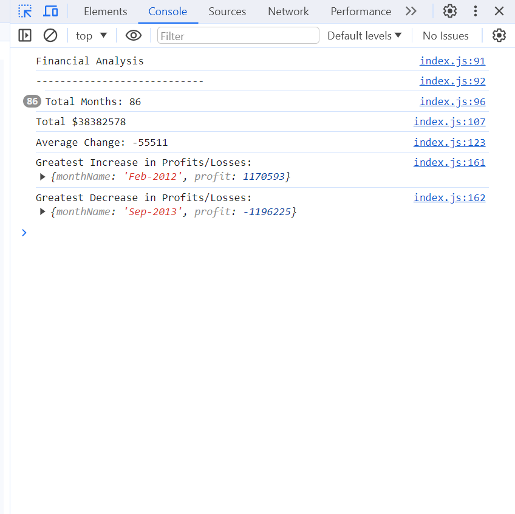

# console-finances

 Eugen's console-finances is a weekly challenge,which shows the creating of code for analyzing the financial records of a company. This  task was to write JavaScript code that analyzes the records to calculate each of the following - the total number of months,the net total amount of Profit/Losses over the entire period, the average of the changes in Profit/Losses, the greatest increase in profits and the greatest decrease in losses.

Usage:

 To calculate the net total amount of Profit over the entire period, I used constants and iteration.

To reach the final amount of Greatest Increase and Decrease, I used constants, if statement and map.

To get to the total net amount of Losses over the entire period, I used constants to create an array with all of the losses numbers and constants to reach the final amount.

To calculate the total amount of months, I used iteration. Here, the "for" statement declares the variable i and initializes it to 0. It checks that i is less than the number of the array, performs the succeeding if statement, and increments i by 1 after each pass through the loop.

